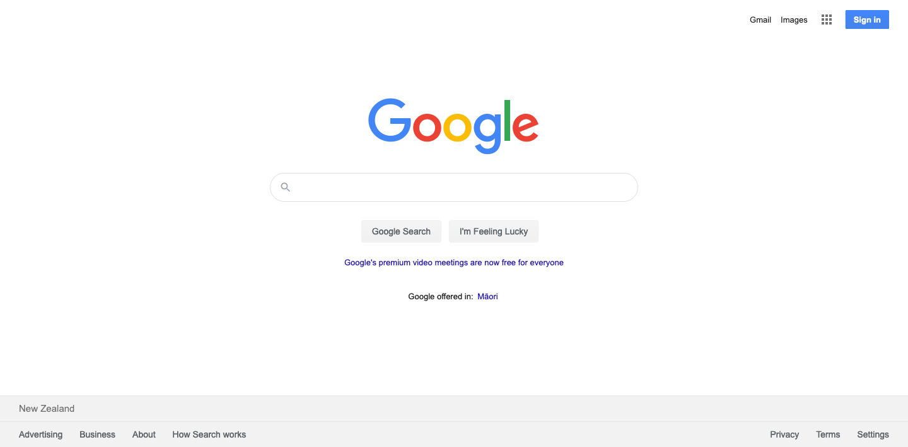

# Project: Clone Google Homepage & Search Result Page

## Project Summary

Project URL:
- ["Google Homepage"](https://sonarin-toun.github.io/clone-google-pages/)
- ["Google Search Result"](https://sonarin-toun.github.io/clone-google-pages/search-result.html?)

This is an assignment from ["The Odin Project"](https://www.theodinproject.com "The Odin Project") in "Web Development 101" module.

I am going to build two pages for this project:

- The [google.com](https://www.google.com/) homepage

- The [Google.com search results page](https://www.google.com/search?q=build+this+webpage)

"This is not a pixel-perfect clone."

## My Journey

Before working on this project, I have followed the odin project road map and complete the curriculum in ["Freecode Camp"](https://www.freecodecamp.org/) without doing any assignment in the curriculum. However, after finishing it, my knowledge on html and css were kind of shaky and I didn't have any confident to start this project.

So I decided to study two additional courses (one for html and one for css):
- ["HTML Essential Training "](https://www.linkedin.com/learning/html-essential-training-4) by Jen Simmon
- ["The Responsive Web Design Bootcamp"](https://scrimba.com/course/gresponsive) by Kevin Powell

Those courses provide me with the knowledge and confident I need to start working on this assignment.

## What I have learned:

After working on this assignment, here is what I have learned:
- the role of both flex-box and grid in website layout and when to use it in the right circumstances. 
- how to use positioning properties whenever flex-box and grid are not applicable
- how i could used SVG in specific circumstances.
- minimize the use of the same line of code multiple time whenever possible
- how to refactor the code

It has been a fun journey. It took me quite a while but I am happy that I could finish the assignment. I am looking forwrad for more of the same!

