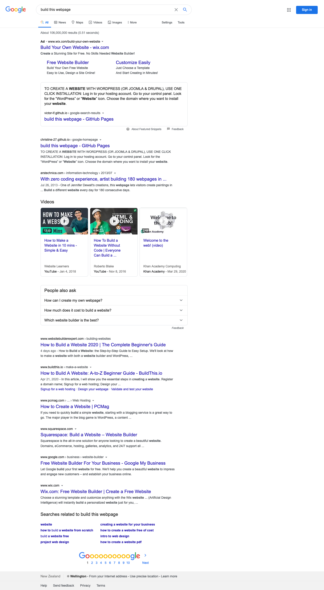

# Project: Clone Google Homepage & Search Result

Project URL:

This is an assignment from ["The Odin Project"](https://www.theodinproject.com "The Odin Project") in "Web Development 101" module.

I am going to build two pages for this project:

- The [google.com](https://www.google.com/) homepage

- The [Google.com search results page](https://www.google.com/search?q=build+this+webpage)

